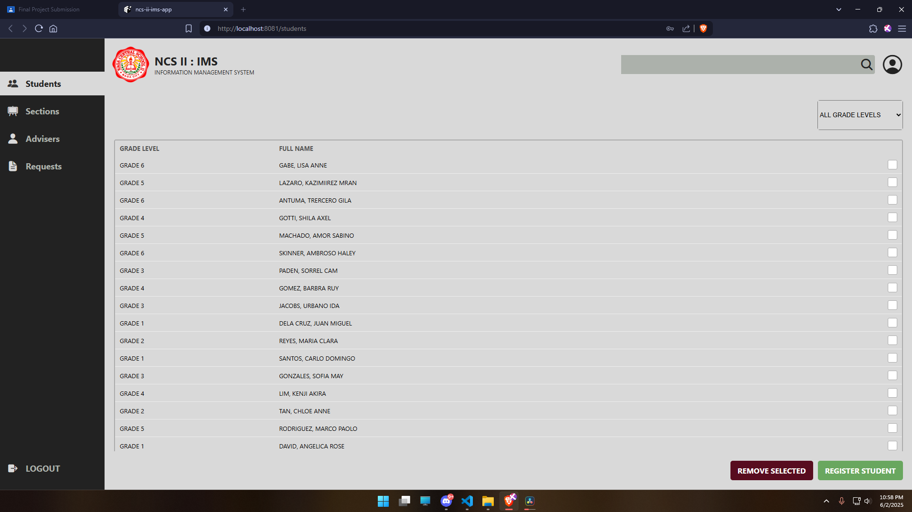
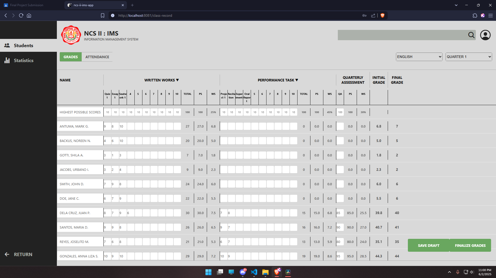

# NCS II Information Management System

The NCS II Information Management System is a comprehensive application designed to streamline and manage information efficiently within the NCS II framework. This system aims to centralize data, improve accessibility, and enhance overall operational effectiveness.

## Features

* **User-friendly Interface:** Intuitive design for easy navigation and data entry.

* **Data Management:** Secure storage and retrieval of NCS II related information.

* **Reporting Tools:** Generate various reports for analysis and insights.

* **Role-based Access Control:** Ensures data security and appropriate access levels for different users.

* **Search and Filter Functionality:** Quickly locate specific information within the system.

## Screenshots

1. **Registration Module Screenshots:** Overview of Registration Module.

3. **Grading/Attendance Module Screenshots:** Overview of Grading/Attendance Module.

4. **Requesting Module Screenshots:** Overview of Requesting Module.

## Setup

To get the NCS II Information Management System up and running on your local machine, follow these steps:

1. **Clone the Repository:** Download the project by cloning the GitHub repository to your local machine.

2. **Install Dependencies:** Navigate to the project directory in your terminal `cd to ncs-ii-ims-app` and run `npm install` to install all necessary dependencies.

3. **Start the Application:** After installation, run `npm run start` to launch the application.

4. **Access the App:** Open your web browser and navigate to the address provided in your terminal.

## Built With

* **React** - A JavaScript library for building user interfaces.

* **Components** - Modular and reusable UI elements.

* **JSX** - A syntax extension for JavaScript, used with React to describe UI.

* **Props** - For passing data between components.

* **`useState` Hook** - For managing component-level state.

* **Context API** - For global state management across the application.

* **Reusable Components** - Emphasizing modularity and efficiency in development.

* **`children` Prop** - For composing components.

* *(Add any other specific libraries, frameworks, or databases used, e.g., Node.js, Express, MongoDB, Tailwind CSS, etc.)*
